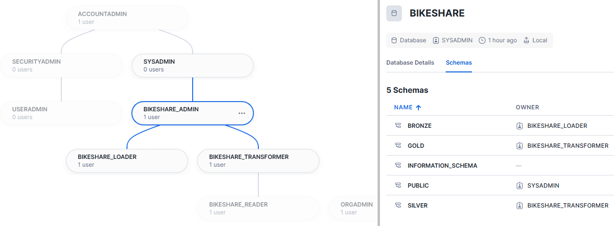
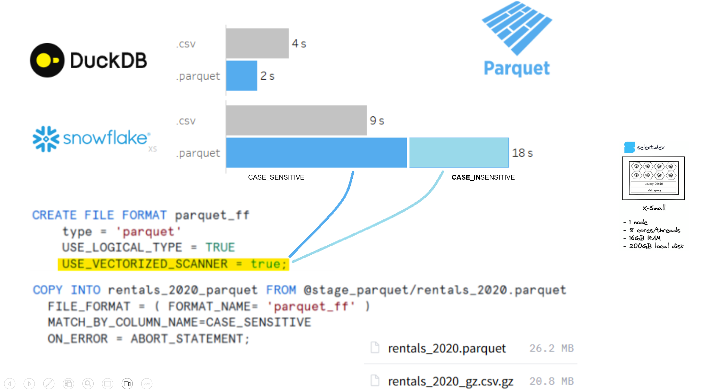

# ❄ snowflake demo project

## Bikeshare project

### Init gouvernance (role, usr, schemas, warehouse, grants)

Inspiration : [dbt - how we use snowflake](https://discourse.getdbt.com/t/setting-up-snowflake-the-exact-grant-statements-we-run/439)

Here is the roles implemented by `bikeshare_init_roleSchemasGrantsUser.sql`

- bikeshare_**admin** *- granted to sysadmin*
  - bikeshare_**loader**        
      uses 💻 `bikeshare_loading_wh` 
      owns 🥉 bonze schemas
  - bikeshare_**transformer** 
      uses 💻 `bikeshare_transforming_wh` 
      owns 🥈 silver & 🥇 gold schemas
    - bikeshare_**reader** 
      using 💻 `bikeshare_reading_wh` 
      reads all schemas 🥉🥈🥇

### 🪖 Admin roles in Snowflake ❄️

Snowflake comes with higly suggested roles to be used (cf. [Access control best practices](https://docs.snowflake.com/en/user-guide/security-access-control-considerations))

- **userAdmin** : add user & adjust ssh public key
- **securityAdmin** : grant privileges (user to group, object to group, group to group ...)
- **sysAdmin** : can delete/create all objects\
  all object roles must have sysAdmin as a parent
- **accountAdmin** : father of userAdmin, securityAdmin, sysAdmin. Use it wisely

## Data loading in snowflake

