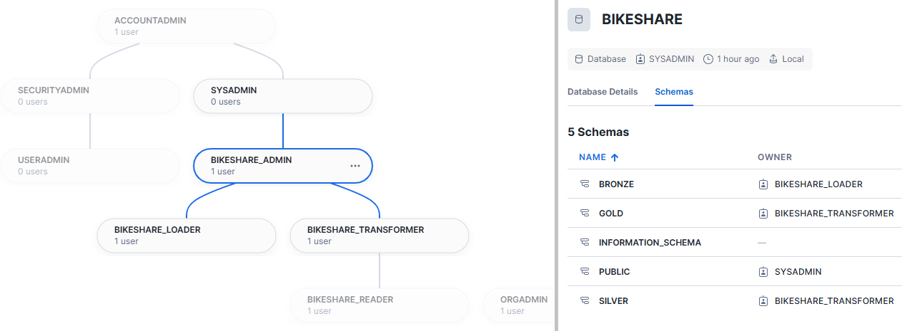

# ❄ snowflake demo project

## bikeshare project

### Init gouvernance (role, usr, schemas, warehouse, grants)

Here is the roles implemented by `bikeshare_init_roleSchemasGrantsUser.sql`

- bikeshare_**admin** * - granted to sysadmin*
  - bikeshare_**loader**        
      uses 💻 `bikeshare_loading_wh` 
      owns 🥉 bonze schemas
  - bikeshare_**transformer** 
      uses 💻 `bikeshare_transforming_wh` 
      owns 🥈 silver & 🥇 gold schemas
    - bikeshare_**reader** 
      using 💻 `bikeshare_reading_wh` 
      reads all schemas 🥉🥈🥇

inspirations
- dbt [how we use snowflake](https://discourse.getdbt.com/t/setting-up-snowflake-the-exact-grant-statements-we-run/439)